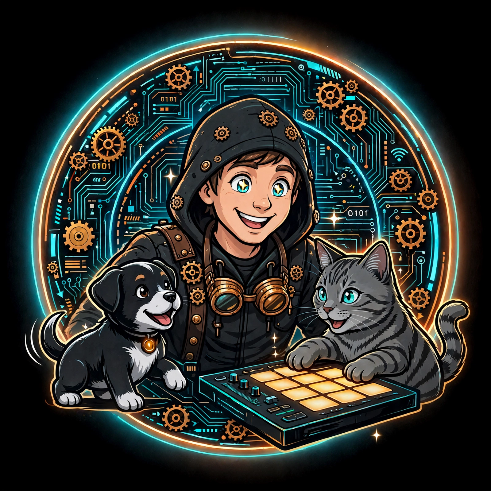

# 🐾 Hub Aky & Rakai

<div align="center">
  
</div>

Bienvenue sur le dépôt du **Hub Aky & Rakai**, un tableau de bord web interactif aux allures de terminal (HUD). Ce projet sert d'interface éducative et biométrique, tissant un lien unique entre la technologie (Intelligence Artificielle locale, interfaces MIDI) et le monde physique.

---

## 🎭 Les Protagonistes

Ce projet est incarné par deux mascottes aux rôles bien distincts au sein du système :

*   **Rakai (Le Chat)** : Le grain de sable créatif. Son nom vient du contrôleur MIDI **Akai MPD218**, détourné de sa fonction musicale première pour devenir l'interface physique d'une Intelligence Artificielle locale (Llama-3.1-8b). Avec sa consonance "racaille", il représente le rebelle du code qui vient tester et éprouver la robustesse du système.
*   **Aky (Le Chiot)** : L'Énergie Créatrice (**Hack-Ki**). Il incarne la symbiose parfaite entre la technologie et la spiritualité. Le terme "Hack" symbolise l'art de comprendre et de détourner les systèmes, tandis que "Ki" représente l'énergie vitale.

---

## 🚀 Fonctionnalités Clés

*   **Interface HUD (Heads-Up Display)** : Un design sombre (Dark Theme) avec des accents cyan/orange, pensé pour rappeler les terminaux de commande.
*   **Responsive & Mobile-First** : Une architecture CSS modulaire (`layout.css`, `resolve.css`) garantissant une expérience fluide sur smartphone avec une barre de navigation fixe et un défilement tactile natif optimisé.
*   **Galerie Dynamique** : Un module de galerie asynchrone (`galerie.js`) exploitant une architecture JAMstack, parfaite pour un hébergement statique.
*   **Sections Modulaires** :
    *   `[01] HUB` : Le centre de contrôle.
    *   `[02] HISTOIRE` : L'origine du projet et le lore d'Aky & Rakai.
    *   `[03] ÉDUCATION` : Modules d'apprentissage et de suivi.
    *   `[04] GALERIE` : Mémoire visuelle du projet.
    *   `[05] DÉFI 28J` : Suivi d'objectifs et interface de progression.

---

## 🛠️ Stack Technique

*   **Frontend** : HTML5 sémantique.
*   **Style** : CSS3 Vanilla (Variables CSS, Flexbox/Grid, sans framework lourd).
*   **Logique** : JavaScript (ES6 Modules).
*   **Hébergement** : Optimisé pour **GitHub Pages** (Architecture statique/hybride).

---

## 💻 Installation & Déploiement

Ce projet est conçu pour fonctionner sans serveur backend complexe (approche serverless/statique).

1. Clonez le dépôt :
   ```bash
   git clone [https://github.com/votre-nom-utilisateur/votre-repo.git](https://github.com/votre-nom-utilisateur/votre-repo.git)